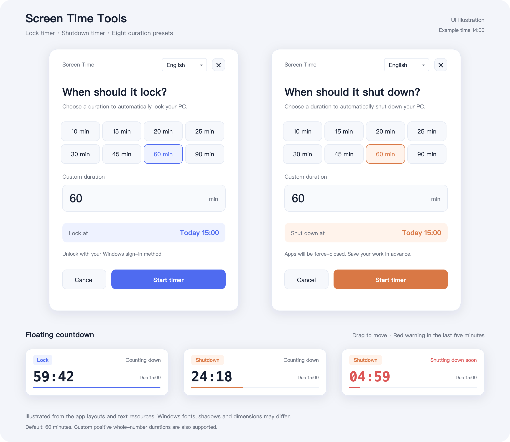

# Screen Time Tools

[English](README.md) | [简体中文](README.zh-CN.md)

A small Windows tool for setting a one-time **lock or shutdown timer**. A floating countdown shows the time left, helping families stick to an agreed screen-time limit.

Requires **Windows 10/11 and the built-in Windows PowerShell 5.1**, running in a signed-in desktop session. No additional software is needed.

## Preview



*Illustrations based on the app's XAML and language resources, rather than Windows screenshots. Times are examples.*

## Quick start

1. [Download the repository ZIP](https://github.com/wind8ai/screen-time-tools/archive/refs/heads/main.zip) or clone this repository. Extract the entire folder and preserve its structure.
2. Double-click `start-lock.bat` for a lock timer, or `start-shutdown.bat` for a shutdown timer.
3. Choose **10 / 15 / 20 / 25 / 30 / 45 / 60 / 90 minutes**, or enter a custom positive whole number. The default is **60 minutes**.
4. Check the expected action time, then select **Start timer**. **Cancel** or the close button exits the settings window.

The floating window stays on top and can be dragged to another position. It shows the action, remaining time, expected action time and progress. The **last five minutes turn red**. The selected action happens once when the countdown reaches zero.

> Shutdown force-closes applications. Save your work first. Locking keeps apps running; unlock with your Windows sign-in method. This is a reminder and timer, not parental-control enforcement: a user who can end its process can cancel it.

Only one timer can run per Windows session, shared across lock, shutdown and test modes. Starting a second timer shows a message and leaves the first running.

## Switch languages

- Choose **中文 / English** in the settings window. The selected language carries over to its countdown.
- Right-click the floating countdown to change its language without restarting the timer.
- Set `language` in [`config/settings.json`](config/settings.json) to `auto`, `zh-CN` or `en-US` to choose a default.
- Pass `-Language en-US` or `-Language zh-CN` to either PowerShell entry point or BAT launcher to override the default. `-Language auto` follows the system for that launch.

The shipped configuration uses `auto`: Chinese system UI languages use Simplified Chinese; all others use English. UI language changes apply to the current window and its worker; they do not rewrite the configuration. Details: [configuration](docs/CONFIGURATION.md).

## Command line and safe tests

Open Windows PowerShell in the repository root:

```powershell
# Start a 45-minute lock timer in English
powershell.exe -NoProfile -STA -File .\src\lock-timer.ps1 -Minutes 45 -Language en-US

# Start a 60-minute shutdown timer in Chinese
powershell.exe -NoProfile -STA -File .\src\shutdown-timer.ps1 -Minutes 60 -Language zh-CN

# Try the complete countdown without locking or shutting down; run these separately
powershell.exe -NoProfile -STA -File .\src\lock-timer.ps1 -Minutes 1 -DryRun -Language en-US
powershell.exe -NoProfile -STA -File .\src\shutdown-timer.ps1 -Minutes 1 -DryRun -Language en-US

# Open English settings through a BAT launcher
.\start-lock.bat -Language en-US
```

| Parameter | Behavior |
| --- | --- |
| `-Minutes <positive integer>` | Start immediately for that many minutes; omit to open settings |
| `-DryRun` | Run the countdown without executing the final action; also works with settings |
| `-Language auto\|zh-CN\|en-US` | Override the configured language for this launch |

Start with a one-minute `-DryRun` test. Run tests one at a time.

## Cancel or change a timer

In Task Manager's **Details** tab, enable the **Command line** column. Find the `powershell.exe` process whose command line contains both `countdown.ps1` and `-Worker`, and end only that process. Then start a new timer if needed.

The tool does not wake a sleeping PC. If the timer has expired on resume, it continues its finish sequence. Timers do not survive sign-out or restart.

## Project structure

```text
screen-time-tools/
├── README.md / README.zh-CN.md     # English and Chinese guides
├── start-lock.bat                  # Double-click lock settings
├── start-shutdown.bat              # Double-click shutdown settings
├── config/settings.json            # Default language
├── src/
│   ├── lock-timer.ps1              # Lock entry point
│   ├── shutdown-timer.ps1          # Shutdown entry point
│   ├── countdown.ps1               # Settings, countdown and final action
│   ├── localization.ps1            # Language selection and text lookup
│   ├── locales/                    # en-US.psd1 and zh-CN.psd1
│   └── ui/                         # Language-neutral WPF XAML layouts
├── scripts/check.ps1               # Syntax and regression checks
├── tests/                          # Countdown and localization tests
└── docs/                           # Bilingual configuration/development guides and previews
```

PowerShell entry points are in `src/`. When upgrading from older flat-layout releases, update shortcuts that point to root `.ps1` files and keep the `src/ui/`, `src/locales/` and `config/` folders.

See [development and validation](docs/DEVELOPMENT.md). To run checks:

```powershell
powershell.exe -NoProfile -File .\scripts\check.ps1 -Language en-US
```
