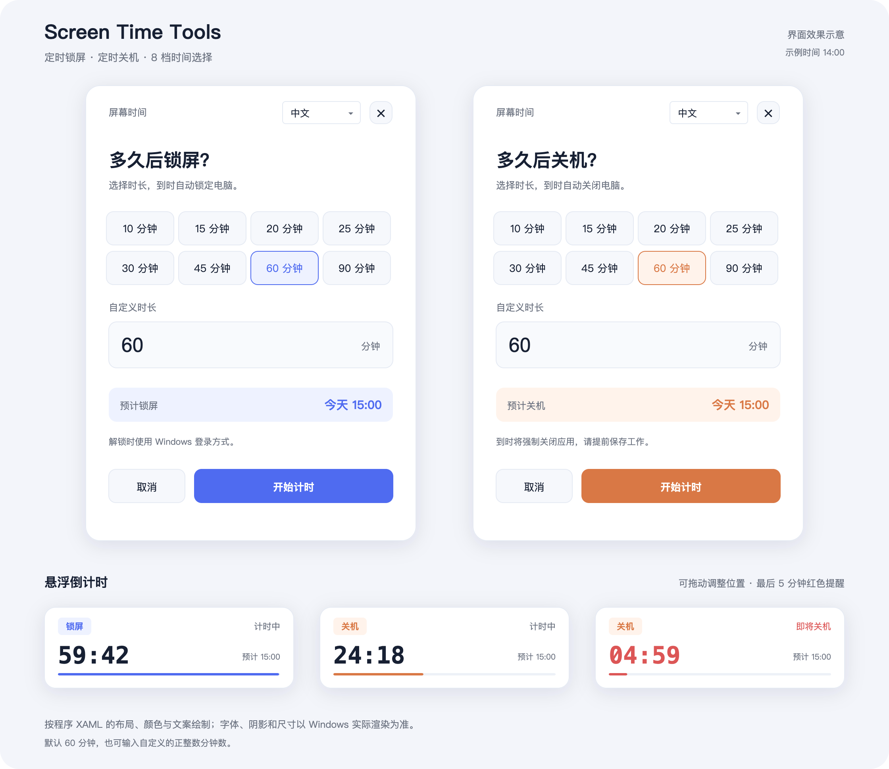

# Screen Time Tools

[English](README.md) | [简体中文](README.zh-CN.md)

Windows 定时锁屏与定时关机工具。选择时长后，悬浮倒计时显示剩余时间，帮助家长和孩子遵守约定的电脑使用时间；到点执行一次所选操作。

适用于 **Windows 10/11 + 系统自带的 Windows PowerShell 5.1**，在已登录的桌面中使用，无需安装额外软件。

## 效果预览



*根据实际 XAML 和语言资源绘制的效果示意，非 Windows 运行截图。示例时刻仅用于展示。*

## 快速开始

1. [下载仓库 ZIP](https://github.com/wind8ai/screen-time-tools/archive/refs/heads/main.zip)，或克隆仓库，完整解压并保留目录结构。
2. 双击根目录的 `start-lock.bat`（定时锁屏）或 `start-shutdown.bat`（定时关机）。
3. 选择 **10 / 15 / 20 / 25 / 30 / 45 / 60 / 90 分钟**，也可输入自定义的正整数分钟数；默认 **60 分钟**。
4. 确认预计执行时间，点击 **开始计时**。设置窗口中的 **取消** 或关闭按钮会退出设置。

悬浮窗置顶显示，可拖动调整位置，包含操作标识、剩余时间、预计执行时间和进度条。**最后 5 分钟显示红色提醒**，到零后执行一次锁屏或关机。

> 关机会强制关闭应用，请提前保存工作。锁屏后应用继续运行，可使用 Windows 登录方式解锁。本工具用于提醒和计时，不提供防绕过的家长控制；能结束其进程的用户也能取消任务。

同一 Windows 会话中同时只运行一个计时任务；锁屏、关机和测试模式共用这个限制。重复开始计时会提示已有任务，原任务继续运行。

## 中英切换

- 在设置窗口选择 **中文 / English**；开始计时后，倒计时窗口使用所选语言。
- 在悬浮倒计时上点击右键切换语言，不会重新开始计时。
- 修改 [`config/settings.json`](config/settings.json) 的 `language`：支持 `auto`、`zh-CN`、`en-US`。
- PowerShell 或 BAT 启动入口支持 `-Language en-US`、`-Language zh-CN`，覆盖本次启动的默认语言。`-Language auto` 在本次启动中跟随系统。

默认配置为 `auto`：中文系统界面语言显示简体中文，其他系统显示英文。界面切换只作用于当前窗口及其计时进程，不会改写配置文件。详细规则见[配置说明](docs/CONFIGURATION.zh-CN.md)。

## 命令行与安全测试

在仓库根目录打开 Windows PowerShell：

```powershell
# 直接开始 45 分钟锁屏倒计时，使用英文
powershell.exe -NoProfile -STA -File .\src\lock-timer.ps1 -Minutes 45 -Language en-US

# 直接开始 60 分钟关机倒计时，使用中文
powershell.exe -NoProfile -STA -File .\src\shutdown-timer.ps1 -Minutes 60 -Language zh-CN

# 体验完整倒计时，结束时不会锁屏或关机；两个测试依次运行
powershell.exe -NoProfile -STA -File .\src\lock-timer.ps1 -Minutes 1 -DryRun -Language zh-CN
powershell.exe -NoProfile -STA -File .\src\shutdown-timer.ps1 -Minutes 1 -DryRun -Language zh-CN

# 通过 BAT 打开英文设置窗口
.\start-lock.bat -Language en-US
```

| 参数 | 作用 |
| --- | --- |
| `-Minutes <正整数>` | 指定分钟数并直接开始；省略时打开设置窗口 |
| `-DryRun` | 体验倒计时，结束时不执行操作；也可与设置窗口搭配使用 |
| `-Language auto\|zh-CN\|en-US` | 覆盖本次启动的配置语言 |

首次使用建议先运行 1 分钟测试。两个测试应依次运行。

## 提前停止或调整时间

在任务管理器的“详细信息”中启用“命令行”列，找到命令行同时包含 `countdown.ps1` 和 `-Worker` 的 `powershell.exe`，仅结束这个进程即可取消任务。之后重新打开设置，选择新时长。

电脑睡眠时不会被主动唤醒；恢复运行时若已到点，将继续执行结束流程。注销或重启后任务不会自动恢复。

## 项目结构

```text
screen-time-tools/
├── README.md / README.zh-CN.md     # 英文与中文使用说明
├── start-lock.bat                  # 双击启动锁屏设置
├── start-shutdown.bat              # 双击启动关机设置
├── config/settings.json            # 默认语言
├── src/
│   ├── lock-timer.ps1              # 锁屏入口
│   ├── shutdown-timer.ps1          # 关机入口
│   ├── countdown.ps1               # 共用设置、倒计时和到期动作
│   ├── localization.ps1            # 语言选择与文案读取
│   ├── locales/                    # en-US.psd1 与 zh-CN.psd1
│   └── ui/                         # 不写死语言的 WPF XAML 布局
├── scripts/check.ps1               # 语法及回归检查
├── tests/                          # 倒计时和语言测试
└── docs/                           # 双语配置、开发说明与效果图
```

命令行入口位于 `src/`。从旧版平铺目录升级时，请更新指向根目录 `.ps1` 文件的快捷方式，并保留 `src/ui/`、`src/locales/`、`config/` 目录。

开发及验证说明见 [DEVELOPMENT.zh-CN.md](docs/DEVELOPMENT.zh-CN.md)。检查命令：

```powershell
powershell.exe -NoProfile -File .\scripts\check.ps1 -Language zh-CN
```
